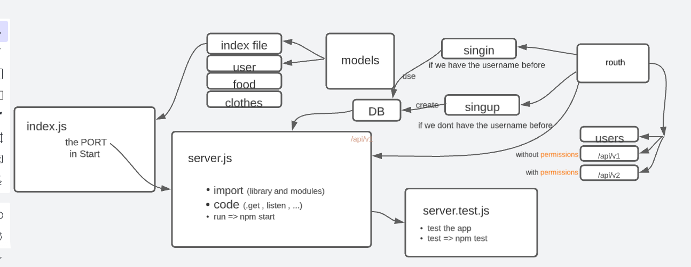

# auth-api (lab 08)

[github-lab08](https://github.com/mr-atta/auth-api)
[heroku-lab08](https://atta-auth-api.herokuapp.com/)

- run the code by using npm start || nodemon
- test the code by using npm test || on the github

  > finish time : 4:30 pm

